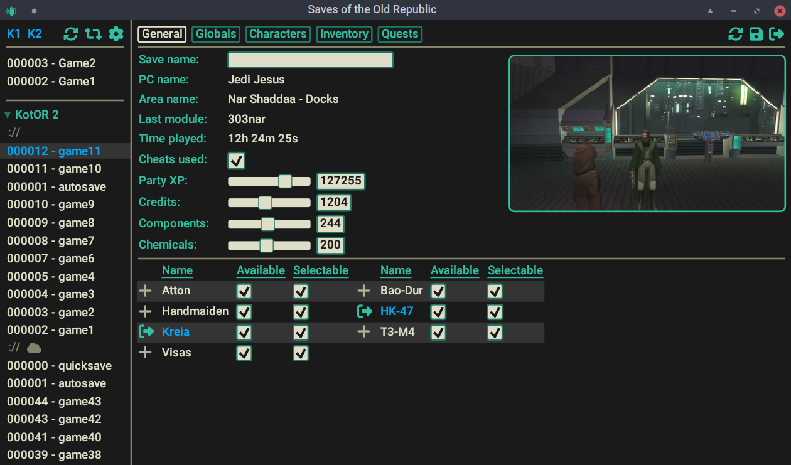

# SotOR: Saves of the Old Republic

This branch is the **Accessible Edition**. It preserves SotOR's existing save
reader and writer while enabling AccessKit and supplying names, roles, values,
states, keyboard activation, and accessible status handling throughout the
interface. See [ACCESSIBILITY.md](ACCESSIBILITY.md) for NVDA instructions and
the validation checklist.


A new save editor for KotOR 1 and 2



# Warning

SotOR is a pathway to many abilities some consider to be unnatural, and generally lacks sanity checks, potentially allowing you to break the save. Also there are bugs, probably.

It creates a zip with the previous version of the save in it's directory, but you may still want to back it up manually.

May or may not work with saves from non-English versions of the game. Use at your own risk.

Saves from the Android version of KotOR 2 have a weird issue with corruption of certain values. This save editor tries to fix them, and the issue doesn't seem to affect anything important in the first place, but I can't guarantee it won't lead to other issues later on.

# Differences from KSE

- Aims to provide the same features and more. Currently WIP.
- Runs natively on Windows, Linux and [in the browser](https://starfishxeno.github.io/sotor/) (experimental, using wasm). Mac version should work, but pre-built releases won't be available here.
- Uses a built-in game database, allowing it to work wihout the game installed. Still capable of loading provided game files for your modding needs. Provided releases assume KotOR 1 Community patch and KotOR2 TSLRCM.
- Support for the updated steam version of TSL, including workshop.
- Does NOT support xbox and switch saves. See "Contributing" section.

# Contributing

If you encounter a bug or have a suggestion, please open an issue on github.

I would like to add support for the console versions, but I don't own any of them. If you're willing to provide save files and help with testing, please open an issue.

# Building

Official Windows packages are built by the `Windows build` GitHub Actions
workflow. Every push to `main` produces a downloadable workflow artifact, and
pushing a version tag such as `v1.2.0` also creates a GitHub release with a
standalone, versioned executable such as `SOTOR-1.2.exe`. GitHub provides the
source-code archives automatically. The workflow uses the private,
checksum-verified `sotor-assets.zip` attached to the `build-assets-v1`
repository release, so no game installation or local compiler is required.

For a local build, install the [Rust toolchain](https://www.rust-lang.org/learn/get-started)
and the platform-specific dependencies for [egui](https://github.com/emilk/egui/tree/3b19303e02bd2d386cf8b85b248388a25bfe9e26/crates/egui_glow)
and [rfd](https://docs.rs/rfd/0.13.0/rfd/index.html#gtk-backend). Then either set
`SOTOR_ASSETS_ZIP` to the reusable asset bundle or install both games and set
`STEAM_APPS` to the Steam `steamapps` directory. A `.env` file may be used for
either setting. See `build.rs` for details.

Example:

```bash
echo SOTOR_ASSETS_ZIP=/path/to/sotor-assets.zip > .env
cargo run #run a debug build
cargo build --release #build a release version
```

To build for other targets you also need to install [cross](https://github.com/cross-rs/cross) and [trunk](https://trunkrs.dev/). See `build-all.sh`.

# Thanks

Thanks to [KSE](https://github.com/nadrino/kotor-savegame-editor), [NWN Wiki](https://nwn.wiki), [KotOR.js](https://github.com/KobaltBlu/KotOR.js) and [xoreos](https://github.com/xoreos/xoreos) projects for providing references on where and how to get the required game data.
